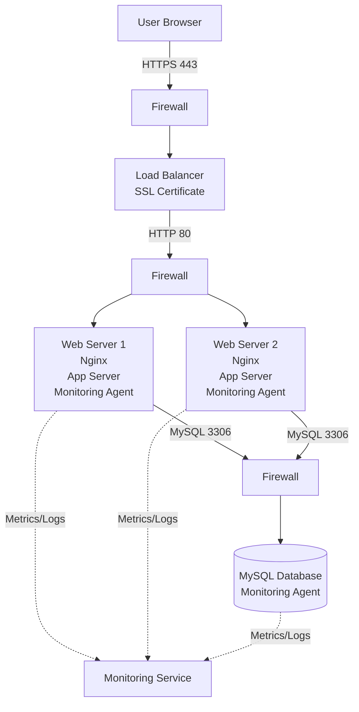

# Secured and monitored web infrastructure

## Infrastructure Diagram

Tu peux dessiner quelque chose comme ceci :

```text
                           Internet
                               |
                         [ Firewall ]
                               |
                         HTTPS (443)
                               |
                    [ Load Balancer + SSL ]
                               |
                         [ Firewall ]
                               |
                -----------------------------
                |                           |
        ------------------         ------------------
        | Web/App Server 1 |       | Web/App Server 2 |
        ------------------         ------------------
        | Nginx            |       | Nginx            |
        | Application      |       | Application      |
        | Monitoring Agent |       | Monitoring Agent |
        ------------------         ------------------
                |                           |
                -------------   -------------
                              |
                        [ Firewall ]
                              |
                      ----------------
                      | MySQL Server |
                      ----------------
                      | MySQL        |
                      | Monitoring   |
                      ----------------
```


---
## Explanations (in English)

### Why are these additional elements added?

**Firewall #1**

Protects the infrastructure from unauthorized access coming from the Internet.

**Firewall #2**

Restricts traffic between the load balancer and the web servers, allowing only required ports and protocols.

**Firewall #3**

Protects the database server by allowing connections only from the application servers.

**SSL Certificate**

Provides HTTPS encryption for www.foobar.com to secure data exchanged between clients and the website.

**Monitoring Clients**

Installed on each server to collect metrics, logs, and performance information and send them to a monitoring platform such as Sumo Logic.

---

## What are firewalls for?

Firewalls control incoming and outgoing network traffic based on predefined security rules. They help prevent unauthorized access and reduce the attack surface of the infrastructure.

---

## Why is the traffic served over HTTPS?

HTTPS encrypts communications between users and the website.

Benefits:

* Protects sensitive information
* Prevents eavesdropping
* Prevents man-in-the-middle attacks
* Increases user trust
* What is monitoring used for?

---

## Monitoring is used to:

- Track server health
- Detect failures
- Measure performance
- Generate alerts
- Analyze logs
- Identify bottlenecks

---

## How does the monitoring tool collect data?

Monitoring agents installed on each server collect:

- CPU usage
- Memory usage
- Disk usage
- Network traffic
- Application logs

The agents send this information to a centralized monitoring platform for analysis and visualization.

---

## What should be done to monitor web server QPS?

QPS means **Queries Per Second** (or Requests Per Second for a web server).

To monitor QPS:

- Configure the web server (Nginx/Apache) to expose request metrics.
- Configure the monitoring agent to collect these metrics.
- Send the metrics to the monitoring platform.
- Create dashboards and alerts based on QPS thresholds.

---

## Issues with this infrastructure
### Why is terminating SSL at the load balancer level an issue?

SSL termination occurs at the load balancer, meaning:

```
Client <-- HTTPS --> Load Balancer
Load Balancer <-- HTTP --> Web Servers
```

The traffic between the load balancer and the web servers is no longer encrypted.

Risks:

- Internal traffic can be intercepted.
- Sensitive data travels in plain text inside the network.

---

## Why is having only one MySQL server capable of accepting writes an issue?

This creates a Single Point of Failure (SPOF).

Problems:

- If the MySQL server crashes, the application cannot write data.
- The entire website may become unavailable.
- No redundancy for write operations.

---

## Why is having servers with all the same components a problem?

Each server contains:

- Web server
- Application server
- Database server

Problems:

**Resource competition**

The database, application, and web server compete for CPU, RAM, and disk resources.


**Scalability issues**

You cannot scale each service independently.


**Maintenance complexity**

Updates become more difficult because all services are coupled together.


**Security risks**

Compromising one server may expose all services hosted on that server.

---

## Conclusion

This infrastructure consists of a load balancer serving HTTPS traffic using an SSL certificate, two web/application servers, and one MySQL database server.

Three firewalls are used to secure communication between the Internet, load balancer, web servers, and database server.

Monitoring agents are installed on all servers to collect metrics and logs and send them to a centralized monitoring service.

The infrastructure provides redundancy at the web server level, encrypted client communications, and monitoring capabilities. However, it still contains a single point of failure at the MySQL server and SSL termination at the load balancer leaves internal traffic unencrypted.
